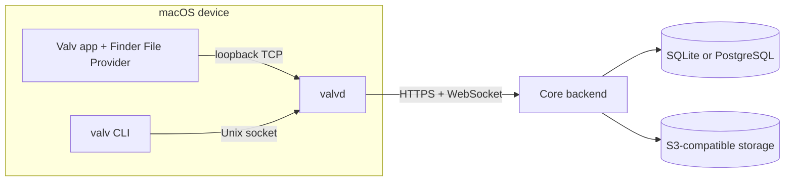

# Valv

**Your files, in sync with people and AI.**

Valv is an open-source, self-hostable file sync product with a Rust sync engine and daemon, a native macOS Finder integration, scoped person/device sharing, and S3-compatible storage.

[](https://github.com/DRNKNDev/valv/actions/workflows/ci.yml)
[](https://github.com/DRNKNDev/valv/releases)
[](./LICENSE)
[](https://discord.gg/29a3dVRdE)

> **Early access.** The macOS app, CLI, daemon, and self-hosted backend are usable today. Expect rough edges and breaking changes between releases.

## Support Matrix

| Component | Platform | Notes |
| --- | --- | --- |
| Valv app (Finder integration, menu bar) | macOS (Apple Silicon), macOS 26.2 or newer | Distributed as a signed, notarized DMG |
| `valv` CLI / `valvd` daemon (prebuilt) | macOS arm64 (`aarch64-apple-darwin`), Linux x86_64 (`x86_64-unknown-linux-gnu`) | Other targets require a source build |
| Core backend | Any OS that runs a current Node.js LTS | Requires SQLite or PostgreSQL and S3-compatible storage |

Windows, Intel macOS, and Linux arm64 are not supported yet.

## Install

- **macOS app:** download the latest DMG from the [GitHub Releases page](https://github.com/DRNKNDev/valv/releases) (the newest `macos-v*` release).
- **CLI (macOS or Linux):**

  ```bash
  curl -fsSL https://valvsync.com/install | bash
  ```

  This installs `valv` and `valvd` for your platform; see [`crates/valv-cli/README.md`](./crates/valv-cli/README.md) for manual install and build-from-source options.

## First Folder

```bash
valv login
valv mount ~/Valv --new
valv status
```

`login` opens a browser to pair this device against the hosted backend (or your own, with `--backend-url`). `mount --new` creates a synced folder, and `status` reports daemon connectivity and per-folder sync state. See [`crates/valv-cli/README.md`](./crates/valv-cli/README.md) for the full command reference, including `share`, `versions`, `restore`, and `update`.

## Implemented Highlights

- Multiple simultaneous folder mounts
- Native Finder integration via a macOS File Provider extension
- Scoped person and device grants (read-only or read-write)
- Content-defined chunking for efficient storage and transfer
- Realtime delta sync over WebSocket push notifications
- Version history and restore per file
- Automatic conflict copies instead of silent overwrites
- Chunk-level integrity verification
- JSON output on every command (global `--json` flag) for scripting/automation
- Signed, checksum-verified CLI/daemon updates and a signed, notarized, Sparkle-updated macOS app

## Self-Hosting

The Core backend is a self-hostable Node.js service (Hono, Drizzle, Better Auth) backed by SQLite or PostgreSQL and any S3-compatible object store (Cloudflare R2, MinIO, Backblaze B2, etc.). It does not ship a Docker Compose stack or a production container image; see [`core/README.md`](./core/README.md) for setup, environment variables, and current limitations.

## Architecture



`valvd` owns the sync engine for every mounted folder. Non-sandboxed clients (the CLI) reach it over a Unix socket; the sandboxed macOS app and File Provider extensions reach it over loopback TCP instead, since app sandboxing rules out the Unix socket path.

## Repository Map

- [`contracts/sync`](./contracts/sync), [`contracts/http`](./contracts/http), [`contracts/ipc`](./contracts/ipc): shared TypeScript types for the op-log/delta-pull protocol, the chunk batch API, and the daemon control protocol.
- [`core`](./core): the Node.js backend.
- [`crates/valv-sync`](./crates/valv-sync): the Rust sync engine (chunking, storage, local mirror, filesystem watching).
- [`crates/valvd`](./crates/valvd): the Rust daemon.
- [`crates/valv-cli`](./crates/valv-cli): the `valv` CLI.
- [`macos/Valv`](./macos/Valv): the native macOS app and File Provider extensions.
- [`macos/DaemonKit`](./macos/DaemonKit): the shared Swift daemon-control library used by the app and extensions.
- [`e2e`](./e2e): the MinIO-backed API test suite and the numbered daemon smoke suite.

## Development

See [`CONTRIBUTING.md`](./CONTRIBUTING.md) for prerequisites and the full set of setup, typecheck, test, and build commands. In short, from the repository root:

```bash
pnpm install
pnpm typecheck
pnpm test:core
```

## Community

- **Questions and discussion:** join the [Valv Discord](https://discord.gg/29a3dVRdE).
- **Bugs and feature requests:** open a [GitHub Issue](https://github.com/DRNKNDev/valv/issues/new/choose). See [`SUPPORT.md`](./SUPPORT.md).
- **Contributing:** see [`CONTRIBUTING.md`](./CONTRIBUTING.md).
- **Security vulnerabilities:** see [`SECURITY.md`](./SECURITY.md); do not report vulnerabilities on Discord or in a public issue.

## License

Valv is licensed under [AGPL-3.0-only](./LICENSE). The full text in [`LICENSE`](./LICENSE) is authoritative.
